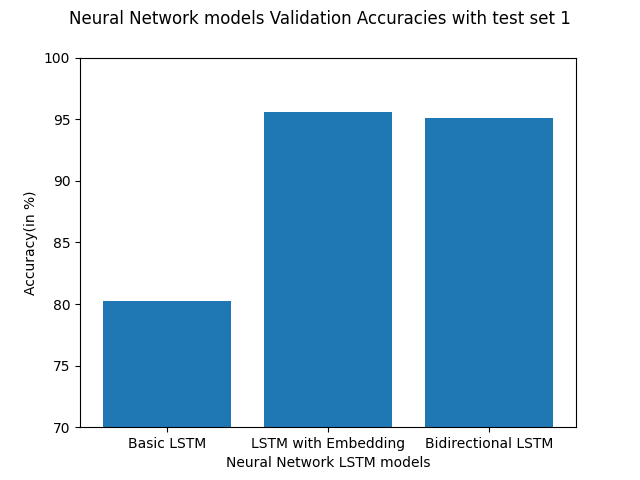

# Q1. Summary
### - Dataset : The dataset used to for training and testing in project was obtained from The Information Security and Object Technology (ISOT) Research Lab of 
### University of Victoria it is the ISOT Fake News Dataset to perform text classification
### - Dataset cleaning: The "Fake" and "True" news csv files are merged and the news texts are mapped to two classes 1: True and 0: False and columns like date and subject are dropped
### - Data splitting: The cleaned data is split of which 80 percent is used to training and testing and 20 percent of the data is used as the first validation test set
### - Data preprocessing: Some common techniques of preprocessing used for text classification are applied to the dataset like removing punctuation from text converting 
### all words to lowercase, removing stopwords and stemming the words.
### - Feature Extraction for Linear Classifier Models : Techniques like CountVectorizer and TfidfVectorizer is used for feature extraction from the preprocessed news text.
### - Training and Testing for Linear Classifier Models: The feature extracted (vectorized) data is trained and tested on Linear Support VectorMachine, Linear Regression and Multinomial Naive Bayes Classifers.
### - Data tokenization for Neural Network Models: The preprocessed data is tokenized for the 3 kinds Long Short Term models 
### - Creaitng pre-trained word embeddings matrix: GloVe pre-trained word embeddings are used to create a word embedding matrix to be fed into the 2 of the LSTM models built in this project
### - LSTM models are built: 3 LSTM models are created one of which is a basic LSTM model which learns the weight from scratch and the other two models are fed pre-trained embedded matrix as weights.
### - LSTM models are trained and tested: The LSTM models are trained and test on the tokenized data.
### - New Dataset created for further Validation: A small 2nd dataset is manually created for further validation test and checking models performances on completly new data which is not a part of the original dataset.
### - Validation tests on Linear Classifier models: Validation tests are performed on all 6 models using 2 seperate datasets.
### - Plotting results: Classification reports, Training, Testing and Validation plots generated for model comparison.

# Q2. Dataset Description
## Dataset Description
The name of the dataset is Information Security and Object Technology (ISOT) fake news dataset it can be found here [Dataset](https://onlineacademiccommunity.uvic.ca/isot/2022/11/27/fake-news-detection-datasets/)
The dataset consists two sets of data Fake news and True news. The fake news samples are collected from various different sources and are flagged as fake by Politico.com.
The true (legitimate) news are obtained from the news website Reuters.com.
### Datest Distribution:
No. of True news samples = 21418
No. of Fake news samples = 23503
### Total no. of samples:
The dataset consists of 41921 samples in total.
### Totol no. of features:
The dataset consists 4 features originally. An extra feature is added later to decribe the class label of each sample
### Feature Description:
title : This gives the text in the headline of the news. It has string values
text: This gives the text in body of the news. It has string values
subject: This gives the category or subject of the news. It has string values
date: This gives the date the particular news was published. It has date values.
class: This classifies the sample as 1 (True) or 0 (Fake) news.
### Group of Interest :
The group of interest this project is the Fake news which is denoted by 0.
### Group not of Interest:
The group not of interest is True news which denoted by 1.
### AUC values:
Note, I have the not calculated the AUC values for this project as it does not make sense for my project. I am only using the text and title columns for my models because the aim of the project here is text classification.

# Q3. Details
#### Dataset Cleaning:
The original dataset consists of two different files "Fake.csv" and "True.csv" which are read into two different dataframes. The two dataframes are then merged and each sample in the text column is mapped to its class label 1(True news)
or 0 (Fake news). The dataset is split into two parts 80 % of the dataset is taken for training and testing and 20% is sampled separated from the dataset and kept for validation later.
This is carried out by the function data_preparation() in the code. L
#### Data Preprocessing:
The cleaned data is preprocessed by merging the title and text columns into one and dropping all the other columns. After this the 
- A commonly occuring word "Reuters" is removed from the True news samples.
- All the is converted to lowercase.
- Stopwords are removed 
- Words are stemmed.
This carried out by the function data_preprocessing() and stopword_remover_stemmer()
Explaination:
I observed the True news samples had a word "Reuters" repeated in all of its samples. I removed it to bring a little more randomness to the dataset and
to prevent the models from having an unfair advantage in detecting the true news in the dataset.
I used some of the commonly used techniques like lower-casing, punctuation removal, stopwords removal and stemming. Stopwords are words like the
, a, are, etc. These words are removed because they commonly occur in all text and don't contribute much to the semantics and context in the text.
So by removing stopwords we remove useless data and reduce the dataset size and the models can then only focus of useful information for classification.
Stemming is when a word is reduced to its original or base word. I think this is done to reduce the dimensionality this is seen when the text is tokenized and feature extraction techniques are performed
because words like created and creative are seen as only one word create rather than two different words.

#### Feature Extraction for Linear Classifier Models:
I have used two different feature extraction techniques TF-IDF Vectorizer and CountVectorizer. Countvectorizer follows the bad of words concept
which just counts the occurence of the words in the text sample but doesn't care about the ordering of the word. Term Frequency and Inverse Document Frequency which considers 
the significance of the word the in the text sample instead of just counting it.
Though Countvectorizer is more commonly used technique for the feature extraction, I used both because I was curious to see how feature method would perform with the Linear classifiers.
The functions data_vectorizer_tfidf() and data_vectorizer_count() carry out this task.

#### Training and Testing for Linear Classifier Models:
Vectorized data is used to train and test 3 Linear classifiers and regressors:
- Linear support vector machine
- Linear Regression
- MultinomialNB (Carried out by functions classifier_models() and model_scores())
- We can see the results of accuracies in 

- First point to note from both the images is that for this dataset there is not much difference in performance for 
both the feature extraction techniques.
- Secondly, the best performing classifier is the dataset is Linear Support Vector Machine as the both its training and testing accuracies are in the higher than 95.
The MultinomialNB model performs the worst on this dataset.
- Since accuracy metric can be often unreliable I have also generated the classification report the test results which we
can refer to here [classifier_test reports using CountVectorizer](outputs/test_classifier_report_with_count.txt) and [classifier_test reports using TF-IDF Vectorizer](outputs/test_classifier_report_with_tfidf.txt)
- Even if we look at the F1-score and precision results for model testing they don't stray far from the accuracy ressults.
- Lastly even the most basic classier models (without any hyperparameter tuning) perform very well on the dataset.

#### Data tokenization for Neural Network Models:
For the LSTM models the data is tokenized and tokenized data is padded to make all the vectors the same length
This is carried out by the function data_tokenizer()

#### Creating pre-trained word embeddings matrix:
I tried to experiment with the concept of transfer learning by some research I found that this can be done by using pre-trained word embeddings
and passing them as weights for the Embedding layer. I used the GloVe pre-trained vectors to create the embedded matrix.
We can Download the pretrained vector from [pretrained_word_vector](https://nlp.stanford.edu/projects/glove/). Note, please download the glove6b.zip file and use the 
word vector with 300 dimensions.

#### LSTM models are built:
I have considered 3 LSTM models for this project:
- Basic LSTM model: This model only has 3 layers, an Embedding layer, a LSTM layer with 500 units and Dense layer with activation sigmoid.
This model doesn't take the word embeddings and instead learns the weights from scratch
- LSTM with Embedding matrix: This model takes the pretrained embedding matrix as its weights. It has one LSTM layer with 200 units and several other layers.
  (I experimented with the number of units for each layer and after a lot of trial and error I got to this model)
- Bi-LSTM with Embedding matrix: This model also takes the pretrained embedding matrix as weights this model is very similar to the LSTM model but, it has a Bi-directional LSTM layer instead of just a LSTM layer.
The models are defined by the functions basic_lstm(), lstm_em() and bi_lstm()
#### LSTM models are trained and tested:
The above-mentioned models are trained and tested with the dataset. We can see the accuracy results of training and testing as follows:

- As expected we see the worst performing model here is the basic LSTM model. The other
two models perform almost equally well
- In my opinion the reason for the 2 models to perform better than the basic LSTM model
is because of the pretrained weights and more number layers escpecially the GlobalMaxpooling layer.
- I observed that GlobalMaxPooling layer spiked the accuracy by a lot. I think this is because my LSTM layer returns the hidden sequences
instead of returning just one output and therefore the GlobalMaxpooling Layer before the final Dense layer helped in reducing the
dimensionality
- It is also observed that the LSTM models don't perform as well on the dataset 
as the Linear SVC model. We see that the testing accuracy are less than 95 unlike the Linear SVC
and Linear Regression.
#### New Dataset created for further Validation:
I had already separated 20% of the original dataset for validation. However, I was curious to know how well the 6 models
perform on a completely new dataset. So the [validation_test_set2.csv](data/validation_test_set2.csv) is small manually created dataset
It contains a total of [10 samples ]() 
no. of True news samples : 4
no. of Fake news samples : 6
The true news was taken from legitimate news websites like [Forbes](https://www.forbes.com/?sh=473a62fd2254) and [NBC news](https://www.nbcnews.com/)
The new dataset goes through the same data cleaning, preprocessing, feature extraction techniques as the other test dataset.
#### Validation tests:
2 Validation tests are performed on all 6 models using two dataset:
- First Validation test is performed using the 20% samples,sampled out of the original dataset
- Second Validation test is performed using the new created the dataset.
We can see the results of the validation test as follows:
##### Classifiers using CountVectoriser Validation Accuracy on ISOT Fake news data(test set 1)

##### Classifiers using CountVectoriser Validation Accuracy on custom news data(test set 2)

##### Classifiers using TfIdfVectorizer Validation Accuracy on ISOT Fake news data(test set 1)

##### Classifiers using TfIdfVectorizer Validation Accuracy on custom news data(test set 2)

##### LSTM models Validation Accuracy on ISOT Fake news data(test set 1)

##### LSTM models Validation Accuracy on custom news data(test set 2)

#### Observation on Validation test performance:
- The models validation test performance with sample of original ISOT dataset is overall the same as their
train and test results.
- However, the performance of the classifiers on the new dataset is exactly inverse of their performance with the ISOT dataset.
With the original dataset the Linear SVM and Linear Regression had the best performance and MultinomialNB had the worst performance of the three.
But with the new custom dataset MultinomialNB has the best performance and the other two classifiers perform poorly.
I think this is because MultinomialNB performs better with new datasets as it depends on probability to make a decision whereas the other two try to draw a line
to divide the two classes.
- The Bidirectional LSTM model performs the best out of the 3 LSTM models with the new custom dataset which is not surprising because Bidirectinal LSTM is known to have good performance in
a text classification task we should also take it into account that the new datatset is really small and is also imbalanced.
- Overall when we compare the validation performance of the classifiers and LSTM models its almost the same as the other test i.e. the bottom line here is
the basic classifier models have a better performance than the LSTM models. This might be because the although the ISOT dataset is balanced and decently sized but it has only about 50k samples, Neural Netwrok models need
bigger dataset to show better performance than the linear classifiers. Another reason might be the word embeddings used as weights for the LSTM models might not be in the same category of the our dataset i.e. if 
the pretrained embeddings are based on a dataset that is also news related or has the similar background  as far as vocabulary is concerned.

